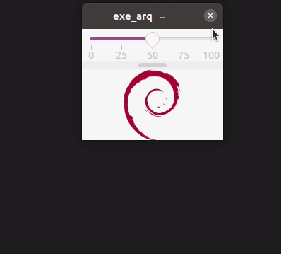

# cap6_scale_scrollbar
## OBS : Este é um "caderno", as informações contidas neste arquivo são anotações pessoais e podem apresentar informações incorretas.

## Perguntas respondidas:
   
* Como utilizar o scrollbar?
* Como utilizar o scale?
* Como como configurar o scale e o scrollbar?

### App

;

As duas declarações abaixo cria um widge do tipo Scale e outro do tipo Scrollbar.

~~~c++
Gtk::Scale m_scale;
Gtk::Scrollbar m_scrollb;
~~~

Para ajuste, pode ser utilizado duas opções.
    
~~~c++
Glib::RefPtr<Gtk::Adjustment> m_adj;
~~~

Para atribuir é utilizado o 

~~~c++
this->m_adj = Gtk::Adjustment::create(50,0,100,10,5,3);
~~~

* O primeiro parâmetro é a posição inicial do marcador.
* O segundo parâmetro é o valor mínimo.
* O terceiro é para o valor maximo.
* O terceiro é quanto o valor vai alterar utilizando o CTRL +
* O penúltimo é quanto o valor vai alterar utilizando somente a tecla +; 

Para adicionar marcações de valores é utilizado o código.

~~~c++
this->m_scale.add_mark(0,Gtk::POS_BOTTOM,"0");
~~~

Para posicionar o local onde o valor sera desenhado é utilizado o comando;

~~~c++
this->m_scale.set_value_pos(Gtk::POS_RIGHT);
~~~

Para conectar o sinal ao widged scale ou scrollbar é utilizado o código abaixo.

~~~c++
this->m_scale.signal_value_changed().connect(sigc::mem_fun(*this,&Scale_Scrool::on_scale_size));
~~~